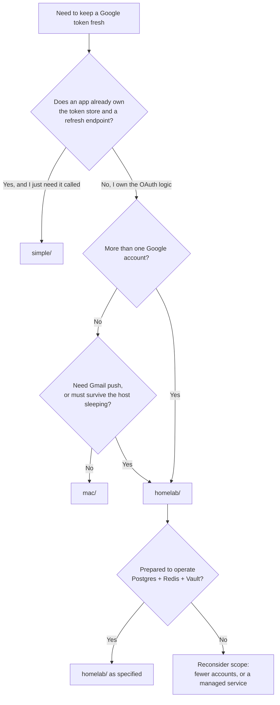

# Architecture Decisions — Three Setups, and Why

A teaching companion to [`adr/`](adr/). The ADRs are the authoritative record of each decision;
this document is the reasoning *across* them — how the three setups relate, which axes actually
vary, and how to tell which one a situation calls for.

**It does not restate the ADRs.** Where a fact belongs to one, this document cites it. If the two
ever disagree, the ADR is right and this file is stale.

> **How to read this.** The first section is the whole argument in five minutes. The middle is one
> section per setup, in depth. The end is a decision matrix, a walkthrough, self-check questions,
> and a reference appendix. Stop wherever you have what you need.

---

## Layer 1 — The mental model

Three deployment shapes exist because three different questions get asked, and each shape answers
exactly one of them:

| Setup | The question it answers |
|---|---|
| [`simple/`](../simple/) | *"An app already handles OAuth. Something must call it on a schedule."* |
| [`mac/`](../mac/) | *"Refresh only when it's actually needed, on one machine I own."* |
| [`homelab/`](../homelab/) | *"Several accounts, and it has to move to a cloud VM without a rewrite."* |

The progression is the argument. Each option exists **because the previous one's failure mode
became unacceptable**, not because it is more sophisticated:

```text
simple/                        mac/                          homelab/
──────────────                 ──────────────                ──────────────
refreshes blindly              refreshes on expiry           refreshes per user,
every 30 minutes               within a skew window          on demand, under a lock
      │                              │                             │
      │ "it burns quota and          │ "I have a second            │
      │  can still miss an           │  account, and the           │
      │  expiry"                     │  laptop closes"             │
      ▼                              ▼                             ▼
   → mac/                        → homelab/                   → (nothing yet;
                                                                see ADR 0007 on k8s)
```

Read the arrows as *symptoms*, not as a maturity ladder. A single-user personal automation that
runs happily on `mac/` has no reason to move to `homelab/`; the multi-user stack costs a Postgres,
a Redis, and a Vault to operate.

### The one thing all three share

Every option implements the same core, specified in
[`spec-001`](../specs/spec-001-token-store.md), [`spec-002`](../specs/spec-002-refresh-engine.md)
and [`spec-004`](../specs/spec-004-scope-registry.md) — *except* `simple/`, which delegates all of
it to the application it pokes:

```text
    caller needs a Google API call
                │
                ▼
    is the access token still valid?     ← the only interesting question
                │
        ┌───────┴────────┐
        │                │
      valid          near expiry
        │                │
        │           refresh with the refresh token
        │                │
        └───────┬────────┘
                ▼
         call the API
```

Everything else — cron vs interval vs queue, SQLite vs Postgres, env var vs Vault — is a decision
about *where that logic runs and who can be trusted with the refresh token*.

### The constraint that outranks all three

While the OAuth client is in **Testing** publishing status, Google expires refresh tokens after
**7 days** ([ADR 0005](adr/0005-testing-mode-refresh-token-expiry.md)). No architecture defeats
this. It means the interesting design question is not *"how do we refresh perfectly?"* but *"how
do we detect and recover when refreshing becomes impossible?"* — which is why `invalid_grant`
handling is a tested path in all three, not an error branch.

---

## Layer 2 — The setups in depth

### `simple/` — the cron poker

**The decision it embodies:** *do not own OAuth logic you do not have to own.*

An Alpine container runs `crond`. Every 30 minutes a shell script POSTs to an existing
application's `/oauth/refresh` endpoint. The worker holds no tokens, stores nothing, and makes no
decisions. Full shape in [`simple/docs/architecture.md`](../simple/docs/architecture.md).

#### Alternatives rejected

| Alternative | Why not |
|---|---|
| Put the refresh loop in the app itself | Works, but couples the schedule to the app's lifecycle — a deploy or crash silently stops refreshing, with nothing external to notice |
| A host cron job instead of a container | No isolation, no restart policy, and the schedule lives outside the deployment artifact |
| Make it expiry-aware | That is `mac/`. Adding token knowledge here means adding a store, a client secret, and a token in a log — the whole point of this option is that it has none of those |

#### Tradeoffs knowingly accepted

- **Refreshes whether or not it needs to** — roughly 48 unnecessary token-endpoint calls a day per
  user. Cheap, but not free, and invisible ([ADR 0002](adr/0002-expiry-aware-refresh-over-fixed-cron.md)).
- **A fixed grid can still lag an expiry.** If the app is down at the moment the token expires, a
  request fails before the next tick repairs it.
- **No per-user visibility.** The worker sees HTTP status codes, not token state. It cannot tell
  you *why* refreshing failed, only that it did.

#### When NOT to use it

- You do not already have an application that owns the token store and a refresh endpoint. Without
  that, this option refreshes nothing.
- You need to know *why* a refresh failed, per account.
- More than one Google account is involved.
- You need push notifications — there is no ingress here.

#### The anti-pattern

> Growing `simple/` into `mac/`.

It starts reasonably: add an expiry check to the shell script, then a place to read the expiry
from, then a database client, then a client secret in the container's environment, then error
classification. Each step is small; the destination is an untested distributed system written in
POSIX `sh` with a credential in it. `mac/` exists so that this migration is a *switch*, not a
gradual mutation. The tell is the first line of the script that needs to know what a token is.

---

### `mac/` — the expiry-aware worker

**The decision it embodies:** *refresh on evidence, not on a timer.*

A long-running Node process on a five-minute tick inside a Docker Desktop container. Each tick it
compares `expires_at` against `now + 10 minutes` and refreshes only if that window is breached.
Full shape in [`mac/docs/architecture.md`](../mac/docs/architecture.md).

```text
every 5 minutes:
    load token
    if expires_at < now + 10 minutes:
        refresh()
    else:
        do nothing            ← the common case, and the point
```

#### Alternatives rejected

| Alternative | Why not |
|---|---|
| Refresh reactively on the first `401` | Zero wasted calls, but every expiry costs one user-visible failed request, and concurrent failures stampede the token endpoint |
| Tighter unconditional cron (every 5 min) | Multiplies the waste without fixing the blindness — the system still cannot say whether a refresh was needed |
| A `launchd` agent running Node natively | Better sleep/wake integration and direct Keychain access, but loses image parity with the other two options and puts the runtime on the host |
| Trust `expires_in = 3600` without storing it | Google is not obliged to return the same lifetime, and any restart loses an in-memory value |

#### Tradeoffs knowingly accepted

- **Correctness now depends on `expires_at` being stored correctly.** A missing or wrong expiry
  turns "refresh only when needed" into "never refresh" — which looks healthy right up until it
  isn't. This is why storing the absolute timestamp from the response is a MUST
  ([`REQ-001-03`](../specs/spec-001-token-store.md)) rather than a nicety.
- **The local clock is load-bearing.** A laptop sleeps; timers do not fire while suspended and do
  not catch up. Hence resume detection ([`REQ-002-09`](../specs/spec-002-refresh-engine.md)).
- **Docker Desktop is a dependency.** If it is not running, nothing inside a stopped container can
  tell you so.
- **The Keychain cannot be reached from inside the container.** The operator's start wrapper
  injects the key, which is weaker than a secrets manager and documented as such
  ([ADR 0003](adr/0003-vault-openbao-for-refresh-tokens.md)).

#### When NOT to use it

- More than one Google account — see the walkthrough below for what actually breaks.
- You need Gmail push notifications. No ingress means polling, and exposing a laptop to the
  internet to fix that is the wrong trade.
- The automation must survive the machine being closed, moved, or asleep for a week.

#### The anti-pattern

> Looping over accounts inside the single-user worker.

`for (const user of users)` looks like a two-line change. It quietly introduces: one account's
failure delaying every other account, no per-user locking, one shared alert stream, and a sweep
whose duration grows with the user count. Multi-user is not a loop; it is
[`spec-300`](../homelab/specs/spec-300-multi-user-queue-worker.md).

---

### `homelab/` — the multi-user queue worker

**The decision it embodies:** *correctness must not depend on the scheduler.*

BullMQ on Redis, a Postgres token table, refresh tokens in Vault/OpenBao, and one Compose stack
that lifts unchanged to a cloud VM. Full shape in
[`homelab/docs/architecture.md`](../homelab/docs/architecture.md).

The load-bearing idea is [`spec-301`](../homelab/specs/spec-301-refresh-on-demand-guard.md): every
path about to call Google checks expiry and refreshes **under a per-user lock, immediately before
the call**. The scheduled sweep keeps tokens warm and surfaces problems early, but the system is
correct without it.

```text
API request
    │
    ▼
acquire per-user lock (with a TTL)
    │
    ▼
check expiry ──valid──────────────┐
    │                             │
 near expiry                      │
    │                             │
 refresh ──invalid_grant──► DEAD, alert, fail this call
    │                             │
    └──────────┬──────────────────┘
               ▼
        release lock, call the API
```

Why the lock wraps the *check* as well as the refresh: two jobs for one user that both read "not
expired" a millisecond before expiry will both proceed, and one will fail mid-call. Why the lock
has a TTL: a worker that dies holding it must not block that account forever.

#### Alternatives rejected

| Alternative | Why not |
|---|---|
| Postgres `SELECT … FOR UPDATE SKIP LOCKED` as the queue | One fewer service and transactional with the token write — genuinely attractive. Rejected because retries, delays and repeatable schedules would all be hand-built ([ADR 0006](adr/0006-bullmq-queue-for-multi-user.md)) |
| RabbitMQ or SQS | Routing power not needed here; SQS also contradicts homelab-first deployment and adds egress on the refresh path |
| Kubernetes instead of Compose | Better secret injection and rolling updates, disproportionate for four containers. Deferred with a migration path in [ADR 0007](adr/0007-docker-compose-portable-deploy.md) |
| AES-GCM column instead of Vault | What the other two options do. At multi-user scale the audit trail and policy scoping are worth a stateful service ([ADR 0003](adr/0003-vault-openbao-for-refresh-tokens.md)) |
| Timer-only refresh, no pre-call guard | Makes the scheduler load-bearing: a Redis outage or a paused sweep becomes a correctness bug rather than a degradation |

#### Tradeoffs knowingly accepted

- **A sealed Vault stops every refresh.** That is the intended fail-closed behaviour, but it means
  an unseal ritual is now part of recovery, and losing the unseal keys loses every stored token.
- **Redis persistence must be configured deliberately.** An ephemeral Redis silently loses
  repeatable job definitions on restart.
- **Distributed locking is easy to get subtly wrong.** The TTL-expiry path needs its own test
  ([`T-300-04`](../homelab/specs/test-plan.md)).
- **No rolling updates under Compose.** A worker restart is a brief gap in scheduled sweeps —
  acceptable precisely because the pre-call guard covers the window.
- **Three stateful services to operate and back up.**

#### When NOT to use it

- One user, one machine. The operational cost is real and buys nothing.
- No requirement to move to a cloud VM.
- You are not prepared to own Vault's unseal and backup story. A Vault whose keys are not backed
  up off-instance is worse than an encrypted column.

#### The anti-pattern

> Treating the sweep as the mechanism.

If a code path can reach Google without passing the guard, the guard is decoration. This is why
[`REQ-301-09`](../homelab/specs/spec-301-refresh-on-demand-guard.md) requires it to be
*structurally* impossible — adapters receive their token only through the guard — with a test
asserting no bypass exists. "We remember to call it" is not an architecture.

---

## The decision matrix

The axes that actually vary. Everything else is a consequence of these.

| Axis | `simple/` | `mac/` | `homelab/` |
|---|---|---|---|
| Trigger | cron, fixed 30 min | interval, 5 min | on-demand + queue + sweep |
| Refresh decision | unconditional | `expires_at` vs skew | `expires_at` vs skew, per user |
| Owns OAuth logic | **no** — the app does | yes | yes |
| Users | 1 | 1 | many |
| Token store | the app's | SQLite / Postgres | Postgres + Vault |
| Refresh token at rest | (the app's problem) | AES-256-GCM column | Vault KV |
| Concurrency safety | not needed | in-process | Redis lock, per user, TTL |
| Ingress / push | none | none (polls) | HTTPS receiver |
| Failure visibility | log file + healthcheck | structured logs + health | logs, metrics, alerts |
| Services to operate | 1 | 1 | 4 |
| Correctness survives scheduler outage | n/a | no | **yes** |
| Governing ADR | [0002](adr/0002-expiry-aware-refresh-over-fixed-cron.md) | [0002](adr/0002-expiry-aware-refresh-over-fixed-cron.md) | [0006](adr/0006-bullmq-queue-for-multi-user.md), [0007](adr/0007-docker-compose-portable-deploy.md) |

### Choosing



The last branch is not a joke. `homelab/` is the right shape for its problem, but choosing it
without the appetite to run and back up three stateful services produces the worst outcome
available: a multi-user system whose secret backend nobody can unseal.

---

## Worked walkthrough — a second Google account appears

The most common real change, traced through each setup. This is where the tradeoffs stop being
abstract.

### In `simple/`

**What changes:** nothing here, and everything in the application. The worker calls one endpoint;
whether that endpoint refreshes one token or fifty is invisible to it.

**What breaks:** the failure counter and healthcheck are now aggregate. One account's dead grant
produces a permanently unhealthy container even though forty-nine accounts are fine, or — worse,
depending on how the app reports — a `200` that hides the one failure.

**Cost:** zero here, unbounded in the app you did not write.

### In `mac/`

**What changes:** more than it looks. The store gains a second row, which the interface already
supports ([`spec-001`](../specs/spec-001-token-store.md) is keyed by `user_id` from the start).
Then:

- The single-flight lock is in-process and per-user — fine. ✅
- The tick loops over accounts, so account 2 waits for account 1's HTTP round trip. ⚠️
- One account in `DEAD` state now emits alerts that say "re-consent needed" without a reliable way
  to act per account, because the consent helper assumes one browser session and one identity.
- Scope sets can now differ per account, and any code assuming a uniform grant is wrong
  ([`REQ-004-06`](../specs/spec-004-scope-registry.md)).
- The health report grows a list, which is fine, but the *alerting* does not: "no successful
  refresh in the window" is now ambiguous about which account.

**Cost:** small if you stop at two accounts and accept sequential ticks. Growing beyond that means
implementing per-user isolation, which is `homelab/` with extra steps.

### In `homelab/`

**What changes:** insert a row and run the consent flow. Per-user locking, per-user circuits,
per-user alerts and per-user scope sets already exist because the option was designed for it.

**What you actually check:** that the new user's Vault path was written and that Postgres holds
only the path ([`T-302-02`](../homelab/specs/test-plan.md)), and that the account was consented
with the intended identity.

**Cost:** minutes.

### The lesson

The migration `mac/` → `homelab/` is not incremental. It is a change of concurrency model,
storage, and alerting granularity at once. That is precisely why [ADR 0001](adr/0001-three-deployment-options.md)
ships three options rather than one that "scales up" — the scaling step is a rewrite either way,
and pretending otherwise means discovering it during an incident.

---

## Self-check

Answers below. If one surprises you, the linked document is the place to go.

1. `simple/` refreshes every 30 minutes and an access token lasts an hour. Why is that not
   obviously fine?
2. `mac/` refreshes only when `expires_at - now <= skew`. What single storage bug turns this into
   a worker that never refreshes, while still looking healthy?
3. Why does `homelab/` hold the per-user lock across the *expiry check*, not just the refresh?
4. A sealed Vault means no refreshes for anyone. Why is that the correct behaviour rather than a
   design flaw?
5. You add a second Google account to `mac/`. Name two things that break which a `for` loop does
   not fix.
6. Which of the three setups is still correct if its scheduler stops entirely, and why?

<details>
<summary>Answers</summary>

1. It mostly is — for one user. The defects are that it burns ~48 unnecessary token calls a day,
   and that a fixed grid can still lag an expiry if the app is down at the wrong moment. Neither
   is fatal alone; together they mean the system cannot tell you whether a refresh was *needed*,
   so nothing can alert on refreshes not happening.
   ([ADR 0002](adr/0002-expiry-aware-refresh-over-fixed-cron.md))

2. A missing, null, or unparseable `expires_at`. If the code treats that as "no refresh needed"
   rather than "refresh now", the worker sits idle forever with a valid-looking log line. This is
   why [`REQ-002-02`](../specs/spec-002-refresh-engine.md) specifies the direction explicitly.

3. Because the check and the action must be atomic per user. Two jobs that both read "not expired"
   a millisecond before expiry will both proceed, and one will fail mid-call. Locking only the
   refresh leaves that race open.
   ([`spec-301`](../homelab/specs/spec-301-refresh-on-demand-guard.md))

4. Because the alternative is falling back to a cache or a plaintext copy of the refresh token —
   which is the thing the whole secret model exists to prevent. Fail-closed converts a security
   compromise into an availability incident, which is the trade you want. It must alert as **one**
   infrastructure event, not one per user. ([`REQ-008-11`](../specs/spec-008-secret-management.md))

5. Any two of: one account's HTTP round trip delaying the others; alerting that cannot say which
   account is affected; the consent helper assuming a single browser identity; per-account scope
   sets that code may assume are uniform; an aggregate health signal that hides one dead grant.

6. `homelab/`, because of the pre-call guard: any path about to call Google refreshes first, so a
   dead sweep degrades freshness rather than breaking correctness. `mac/` stops refreshing when
   its tick stops. `simple/` has nothing but the scheduler.

</details>

---

## Reference appendix

### Option → specs → ADRs

| Option | Own specs | Shared specs implemented | Governing ADRs |
|---|---|---|---|
| `simple/` | [`spec-100`](../simple/specs/spec-100-cron-refresh-worker.md) | 007, 008, 009 (partial) | [0001](adr/0001-three-deployment-options.md), [0002](adr/0002-expiry-aware-refresh-over-fixed-cron.md) |
| `mac/` | [`spec-200`](../mac/specs/spec-200-expiry-aware-worker.md) | 001–005, 006 (polling only), 007–009 | [0002](adr/0002-expiry-aware-refresh-over-fixed-cron.md), [0003](adr/0003-vault-openbao-for-refresh-tokens.md), [0004](adr/0004-incremental-authorization.md) |
| `homelab/` | [`spec-300`](../homelab/specs/spec-300-multi-user-queue-worker.md), [`301`](../homelab/specs/spec-301-refresh-on-demand-guard.md), [`302`](../homelab/specs/spec-302-vault-integration.md), [`303`](../homelab/specs/spec-303-schema-and-migrations.md) | all of 001–009 | [0003](adr/0003-vault-openbao-for-refresh-tokens.md), [0006](adr/0006-bullmq-queue-for-multi-user.md), [0007](adr/0007-docker-compose-portable-deploy.md) |

### The ADRs, one line each

| ADR | Decision |
|---|---|
| [0001](adr/0001-three-deployment-options.md) | Ship three parallel options rather than one that scales |
| [0002](adr/0002-expiry-aware-refresh-over-fixed-cron.md) | Expiry-aware refresh is the default; fixed cron only in `simple/` |
| [0003](adr/0003-vault-openbao-for-refresh-tokens.md) | Vault/OpenBao holds refresh tokens in `homelab/` |
| [0004](adr/0004-incremental-authorization.md) | Request scopes incrementally; store what was granted |
| [0005](adr/0005-testing-mode-refresh-token-expiry.md) | Treat 7-day refresh-token expiry as a normal condition |
| [0006](adr/0006-bullmq-queue-for-multi-user.md) | BullMQ on Redis for the multi-user worker |
| [0007](adr/0007-docker-compose-portable-deploy.md) | Compose everywhere; Kubernetes deferred with a migration path |

### Where to go next

- [`architecture-overview.md`](architecture-overview.md) — the three options as built, with diagrams
- [`token-lifecycle.md`](token-lifecycle.md) — the state machine all three implement
- [`security-model.md`](security-model.md) — the threat model behind the storage decisions
- [`agentic-orchestration.md`](agentic-orchestration.md) — how these documents and specs get built
