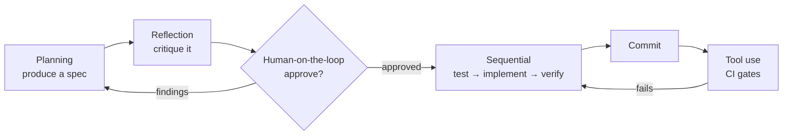
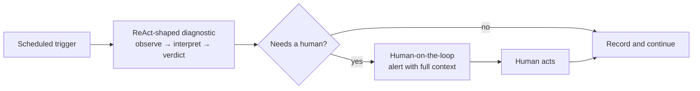

# Eight Agentic Patterns, One Real Project

*A case study in building a specification-first system with LLM agents — what the patterns are,
where each one earns its keep, and the places they failed.*

---

## Why this case study

Most writing about agentic patterns demonstrates them on toy problems. A reflection loop improves
a haiku. A supervisor coordinates three agents to write a to-do app. The patterns look clean
because nothing is at stake and nothing has to be maintained afterwards.

This is an account of using all eight on a real project, over two working sessions, producing
artifacts that have to survive contact with a future reader. It includes the parts that went
wrong, because those are where the patterns actually teach something.

**The project.** An OAuth token-rotation system for a third-party API. Access tokens live about an
hour; a background worker must refresh them before they expire, store the long-lived refresh
credential safely, and recover when refreshing becomes impossible. Three deployment shapes were
specified — a minimal scheduled poker, a single-host worker that refreshes only when needed, and a
multi-user service with a queue and a secrets manager.

**What was actually built.** Seventy-eight markdown documents: fifteen numbered specifications
carrying 231 requirements and 240 test identifiers, seven architecture decision records, four
operational runbooks, and a toolchain of five agents, five skills and twelve commands. **No
runtime code.** That was the deliberate scope — specifications first, implementation later, driven
by tests written from those specifications.

That constraint makes this a good case study rather than a weak one. When the deliverable is
prose, there is no compiler to catch a bad decision. Every quality gate has to be constructed on
purpose, which forces the patterns into the open.

**Two honest caveats.** First, one project is one data point; where a claim is a generalisation
rather than an observation, it says so. Second, the account of what went wrong is not modesty —
the failures are the most transferable part.

---

## Part 1 — Three rules that outrank every pattern

Before any pattern, three properties determine whether an agentic loop is useful or merely
expensive. A weak prompt with all three beats an elegant one without them.

### Rule 1 — The exit condition must be falsifiable by something that is not the model

"Iterate until the code is good" is not an exit condition. Every iteration produces a plausible
reason to continue, and the loop stops when the budget runs out or when the model decides it feels
finished — which is not a signal.

Compare the exit condition this project used for a specification:

> Every MUST-level requirement has at least one test identifier, and every test identifier appears
> in the test plan of each deployment shape the specification applies to.

That is checkable by a shell script. It has nothing to do with whether anything reads well. A model
cannot satisfy it by being more articulate, which is the entire point.

The general form: **an exit condition you can only evaluate by asking the model is not an exit
condition.** It is a mood.

### Rule 2 — State must live outside the conversation

If the loop's memory is the context window, it dies with the context window. It cannot be resumed
by a fresh session, cannot be audited, and cannot be handed to a different agent.

This project externalised state into three places:

| Where | What it holds |
|---|---|
| Numbered requirement and test identifiers | The unit of work, permanently addressable |
| Specification and test-plan files | What must be true, and how it will be proven |
| Git history | What changed, when, and the reasoning at the time |

The practical payoff is a sentence: **"make `T-002-06` pass."** A session that has never seen the
project can be given that, find the test identifier, read the requirement it traces to, and work.
No context transfer, no summary of a previous conversation, no re-derivation.

Identifiers being *permanent* matters more than it sounds. Renumbering breaks every reference in
every commit message, review comment and test name that came before. The rule adopted was: never
renumber, never reuse; retire an identifier by marking it superseded and keeping the number.

### Rule 3 — There must be a gate the model cannot talk past

Self-assessment is generous. Not dishonest — generous. A model asked whether its work meets a
standard it also wrote will usually say yes, and will produce reasoning that sounds like
verification.

Gates that work are the ones running outside the model: a test suite, a linter, a script, a human.
The strongest evidence for this appears in Part 4, where a gate written *by the same process that
wrote the thing it was gating* caught its own first version being wrong on the first run.

---

## Part 2 — The eight patterns

Four describe how a single agent behaves. Four describe how several agents or stages relate.

---

## Core workflow patterns

### 1. Reflection

**The pattern.** Output is fed back for critique against explicit criteria, then revised. Producer
and critic are separated so the critique is not self-congratulation.

```text
   produce ──► critique against stated criteria ──► revise
      ▲                                               │
      └──────────── until criteria met ───────────────┘
```

**How it was used.** A specification review command ran two distinct passes. First, nine mechanical
checks implemented as shell scripts: is the front matter valid, does every MUST carry a test
identifier, does each test identifier map to exactly one requirement, do all relative links
resolve. Then a judgement pass hunting for specific, named defects — unfalsifiable wording,
compound requirements, missing prohibitions, contradictions between files.

**The result that matters.** All nine mechanical checks passed. The judgement pass found nine
defects. Full detail in Part 4, but the headline is that the two passes found **disjoint classes
of defect** — neither could have found the other's.

**What makes a critic useful.** The criteria. Compare two:

| Weak | Strong |
|---|---|
| "Are the requirements clear?" | "Does any requirement contain the word *correctly* or *properly*?" |
| "Is this well specified?" | "Does every MUST have a test identifier?" |
| "Any security issues?" | "Does anything permit a token value in a log, an error, or an image layer?" |

The strong versions are answerable without judgement, which means a critic cannot flatter itself
past them.

**Its characteristic failure: rubber-stamping.** A critic given vague criteria returns "looks
solid, a few minor nits" indefinitely. The countermeasure used here was explicit permission to
find nothing:

> If the artifact is sound, say so and name what you checked. Do not invent findings to appear
> thorough.

That second sentence matters as much as the first. A critic that manufactures findings to seem
useful is as damaging as one that finds none — it trains the reader to discount all findings,
including the real one.

**The transferable lesson.** Put the mechanical checks first, and run them as code. They are cheap,
they never get tired, and they clear the ground so the expensive judgement pass is spent on what
only judgement can see.

---

### 2. Tool use

**The pattern.** The model acts on the world through a constrained set of tools rather than
emitting text and hoping something acts on it.

**How it was used.** Five agents were defined, each with a deliberately *unequal* tool allowlist:

| Agent role | Tools | What the restriction encodes |
|---|---|---|
| Specification writer | Read, Write, Edit, Grep, Glob | **No shell.** It writes prose; it has no business running commands |
| Security reviewer | Read, Grep, Glob, Shell | **No write access.** A reviewer that can edit is tempted to fix instead of report |
| Architect | Read, Grep, Glob, Shell, Web fetch | **No write access.** Designs, does not implement |
| Test author | Read, Write, Edit, Grep, Glob, Shell | Needs the shell to run tests and confirm they fail correctly |
| API integrator | The above, plus web search | Explicitly instructed to fetch current vendor documentation rather than answer from memory |

**Why the withheld tool is the interesting one.** Removing write access from the security reviewer
is not primarily a safety measure — it is a workflow statement. It keeps *review* and *repair* as
separate steps with separate approvals. A reviewer that can edit the file it just flagged will
sometimes fix the finding instead of reporting it, and the finding disappears without ever being
recorded, decided on, or learned from.

**Its characteristic failure: tool sprawl.** Every agent gets every tool "just in case", after
which role boundaries exist only in the prose describing them. The tell is easy to check: if the
reviewer can edit, the boundary is decorative.

A subtler version: withholding a write tool while leaving shell access. The restriction is now
theatre, because a shell is a write tool wearing a disguise.

**The transferable lesson.** Tool allowlists are where role design becomes enforceable rather than
aspirational. Decide what each role must not be able to do, then make it so.

---

### 3. ReAct

**The pattern.** Interleaved reasoning and acting. Observe, reason about what the observation
means, act, observe the result, repeat. The distinguishing feature is that each action is chosen
*after* seeing the previous result rather than planned up front.

```text
   THOUGHT:      what I believe, and which hypothesis I am testing
   ACTION:       one step, chosen to ELIMINATE a hypothesis
   OBSERVATION:  what actually happened
   UPDATE:       what is now ruled out
```

**How it was used — partially.** This is the honest one: the project uses ReAct's *shape* without
running it as an autonomous loop. The diagnostic commands are structured as chains where each check
is chosen based on the previous result. The clearest is the push-notification diagnostic, which
walks a chain — does the topic exist, does the publisher have rights, does a subscription exist, is
the endpoint reachable, does the receiver authenticate, does it acknowledge promptly — where each
link fails silently in a different way.

That chain is written as prose for a human to follow. Nothing executes it autonomously.

**What full ReAct would look like here.** Given "refreshes are failing", an agent picks its next
probe from the previous observation: check whether the secrets backend is sealed → if so, stop and
alert, because that explains everything at once; if healthy, check one account's token state → if
dead, check the credential's age to distinguish scheduled expiry from revocation. Each probe
eliminates a branch.

**Its characteristic failure: thrashing.** Re-observing the same thing under slightly different
phrasing without narrowing anything. The countermeasure is a rule that sounds pedantic and is not:
**every action must be capable of ruling something out.** If a proposed action cannot eliminate a
hypothesis, it is data-gathering rather than diagnosis, and it should be justified as such.

**The cost note.** ReAct is the most expensive core pattern, because every cycle carries the full
history. Cost grows super-linearly with cycle count. That is the real argument for a step budget —
not tidiness, arithmetic.

---

### 4. Planning

**The pattern.** Decompose before acting. Produce a plan artifact, review it, then execute — rather
than discovering scope halfway through.

**How it was used.** Every specification began as a plan artifact before any requirement was
written. At session level, the working mode was: investigate, write a plan to a file, get it
approved, then execute.

**What made the plans useful rather than ceremonial.** Three things:

1. **Investigation before proposal.** A plan written from assumptions is a guess with formatting.
   The instruction was to read the relevant material first and name specific paths.
2. **One recommendation, not a survey.** A plan listing three options with no recommendation has
   deferred the decision it existed to make.
3. **A durable, numbered output.** Requirement identifiers outlive the session that created them.

**The deflationary first question.** The specification command opens by asking whether the request
is actually a new specification at all:

> A new component → a new spec. A new behaviour of an existing component → a new requirement in
> that spec, not a new spec. A choice between viable approaches with lasting consequences → an
> architecture decision record.

Most requests turn out to be the second and get treated as the first. Asking the question first
prevents a proliferation of thin documents.

**Its characteristic failure: planning that never converts.** Successive refinements of a document
nobody executes. The countermeasure is a mechanical done-condition — a specification is complete
when every MUST has a test identifier, which a plan cannot satisfy by being better written.

**The cost note.** Planning is cheap relative to what it saves. One wrong implementation costs more
than ten plans. Investigation dominates the token spend, and it should — this is the
highest-leverage reasoning in the workflow, and errors here propagate into everything downstream.

---

## Orchestration patterns

### 5. Sequential

**The pattern.** Stage N's output is stage N+1's input. Order is fixed; each stage has an exit
condition that must hold before the next begins.

**How it was used.** The development spine:

```text
specify ──► review ──► write failing tests ──► implement ──► verify ──► commit
```

Each stage refuses to start until the previous one's exit condition holds. The implementation
command opens by checking that failing tests already exist, and states the consequence plainly:
implementation that arrived before its failing test means deleting the code and starting from the
test.

**The exit condition worth stealing.** The test-writing stage exits when tests exist *and fail for
the intended reason*. Not "tests exist" — tests fail for the right reason.

This catches the most common false green in test-first work: a test that fails on a typo, a missing
import, or a wrong path. It fails, the light is red, everyone proceeds, and the test has verified
nothing. Requiring the failure message to be read and confirmed costs seconds and catches a class
of defect that otherwise survives to production.

**Its characteristic failure: error propagation.** A vague requirement becomes a vague test becomes
plausible-but-wrong code, and every downstream stage confirms the original mistake with increasing
confidence. The countermeasure is a rule at each handoff: if the input is ambiguous, stop and name
the ambiguity rather than guessing. Push the failure back up the chain instead of laundering it.

**The cost note.** Predictable — roughly the sum of the stages, with no re-reasoning overhead.
Latency is also the sum, which is the pattern's real cost. Stages can use different model tiers;
mechanical stages often run fine on a cheaper model, with the strong model reserved for wherever
judgement actually lives.

---

### 6. Parallel

**The pattern.** Independent branches run concurrently, then merge under explicit criteria.

**How it was used — partially, and this is where the project is weakest.** Continuous integration
runs two jobs concurrently: one checking documentation and specification consistency, one running
lint and tests. The merge criterion is that both must pass. Within a session, independent read-only
operations were batched rather than serialised.

That is genuine parallelism, but it is the easy kind. The interesting kind was designed and not
built.

**What fuller parallelism would look like here.** Three reviewers examining the same change
simultaneously from different angles — security, correctness, maintainability — with a merge rule
declared in advance:

> Security findings are blocking. Correctness findings are blocking if they can produce wrong
> output, otherwise advisory. Maintainability findings are advisory. Where security and correctness
> conflict, security wins.

The agents exist and their perspectives genuinely differ. What is missing is the merge rule — and a
fan-out without one is how parallelism turns into noise.

**Its characteristic failure: no merge criteria.** Three reviewers return three opinions, and the
orchestrator picks whichever it read last or averages them into mush. A blocking security finding
does not average with two approvals.

The failure has a specific tell: the merge rule gets written *after* the results come back. At that
point it is being written to justify a conclusion rather than to reach one.

**Second failure: parallelising work that shares state.** Two agents editing the same file
concurrently produce a merge conflict at best and a silent overwrite at worst. If branch B needs
branch A's output, that is a dependency, and dependencies are sequential regardless of how the
diagram is drawn.

**The cost note.** Cost is the sum of branches — genuinely N× — while latency is the maximum. That
is the entire trade: buying wall-clock time with tokens. Only worth it when the branches are real.

---

### 7. Supervisor

**The pattern.** A coordinator decomposes work, dispatches it, evaluates results, and decides
whether to iterate, escalate, or stop.

**How it was used.** A self-paced development command drives one specification toward completion:

```text
assess coverage ──► select the highest-value gap ──► dispatch a small batch
      ▲                                                      │
      │                                                      ▼
      └──────────── evaluate against exit conditions ◄── implement, verify
```

**Three properties that make it a supervisor rather than a script.** It *chooses* what to work on
next based on an assessment step. It *batches* — two to five units, not the whole specification. And
it has enumerated conditions under which it stops and asks a human.

**The stop conditions, because enumeration is the point.** Not "stop if you get stuck", which is
unactionable, but:

- The specification is ambiguous in a way that would change behaviour
- A test would require a real credential
- The work needs access the agent does not have
- Two requirements conflict, or the work contradicts a settled decision
- **The same unit has failed three iterations for different reasons**

The last is the most useful and the least obvious. Three different failures on one unit is not bad
luck; it is a design problem wearing a coding problem's clothes. Continuing to attempt it burns
budget on the wrong question.

**Its characteristic failure: unbounded fan-out.** A supervisor that can spawn work without a budget
will, because each sub-task looks locally reasonable. Budget it explicitly, and specify what happens
when the budget is exhausted — escalate, not silently truncate.

**Second failure: reporting progress that has not happened.** The instruction used here:

> "Three requirements implemented, two failing" is useful. "Good progress" is not.

**The cost note.** The most expensive pattern — coordination overhead plus the work itself plus
re-assessment each round. The supervisor needs the strong model, because selection and evaluation
are the hard parts; dispatched units can often run a tier lower. If the supervisor is cheap and the
workers expensive, the architecture is upside down.

---

### 8. Human-on-the-loop

**The pattern.** The system runs autonomously but surfaces decisions a human must make, and waits.
Distinct from human-*in*-the-loop, where a human approves every step.

**How it was used.**

| Gate | The decision reserved for a human |
|---|---|
| Re-authorisation | Only a human can complete a browser consent — and must first establish *why* the credential died |
| Credential rotation drill | Confirm which environment before touching anything |
| Plan approval | The plan is written by the model, approved by the human, then executed |
| Permanent-failure alerting | The system detects and stops; a human decides |

**Why these and not others.** Each is irreversible, outward-facing, or needs context the system
lacks. Everything else runs unattended.

The re-authorisation flow is the sharpest example of the pattern done properly. Before generating
anything, it requires establishing the cause of the failure, because the causes lead to different
follow-ups — a scheduled expiry is routine maintenance, while a revoked credential means *someone
revoked it*, and re-authorising without asking why can walk straight back into a security incident.

The human is not there to click approve. They are there because the question is genuinely theirs.

**Its characteristic failure: human-in-the-way.** Approval gates on reversible, low-stakes steps
until approval becomes reflexive — at which point the gate that matters is also approved
reflexively. Approval fatigue does not degrade gracefully; it disarms the whole mechanism.

**Second failure: standing authorisation.** "You approved deleting that branch" is not approval to
delete this one. Approval in one context does not extend to the next.

**The cost note.** Token cost is negligible. The cost is *human attention*, the scarcest resource in
the system. Optimise for fewer, better-framed interruptions. Latency is unbounded — the human may
be asleep — so anything on this path must tolerate an indefinite wait rather than time out into a
half-applied state.

---

## Part 3 — How they compose

Patterns stack. The project's development loop is four of them:



And the maintenance loop is two, running on a schedule that never ends:



### Four composition rules learned the hard way

1. **Compose deliberately.** Each layer multiplies cost and failure surface. Most tasks that look
   like they need a supervisor need a sequential chain.
2. **One stop condition per layer**, and the outermost one wins. Nested stop conditions that
   disagree produce loops that terminate for reasons nobody intended.
3. **Do not nest supervisors.** Two levels of coordination means neither owns the budget.
4. **Human-on-the-loop belongs at the boundary**, not sprinkled through the middle. Interruptions
   in the middle of a chain produce half-applied state.

### The asymmetry worth internalising

The development loop has an end state. The maintenance loop does not. That single difference drives
every design decision about the second one: no unbounded retries, no silent failures, and — the one
most often missed — **alerting on the absence of success, not only on the presence of failure**.

A maintenance loop that stops running produces silence. Silence looks exactly like everything being
fine.

---

## Part 4 — A worked trace, including the part that went wrong

The most instructive run of the project: a specification review that found nine defects, eight
fixes applied, and one quality gate that caught itself being wrong.

### Phase 1 — Mechanical checks, all passing

Nine checks ran as shell scripts before any judgement: front matter validity, every MUST carrying a
test identifier, one requirement per test, test identifiers present in the applicable plans,
fixtures named, index membership, required sections present, links resolving.

**All nine passed.** A rubber-stamping critic stops here and reports that the specifications are
clean.

### Phase 2 — Judgement, nine defects

| # | The defect | Why no script could catch it |
|---|---|---|
| 1 | A requirement said "the **verified** ID token's subject claim" — but nothing required verification | An adjective is not a requirement. Catching it needs a reader who knows the subject claim is the store's primary key |
| 2 | Two requirements gated on a deployment fact the running system had no input for | Requires cross-referencing requirements against the configuration surface |
| 3 | "Be idempotent, **or documented as not idempotent with the reason**" | Syntactically fine, unfalsifiable in substance — any implementation passes by writing a sentence |
| 4 | A requirement referenced a rate-limit figure that was never written down | Needs following the citation and noticing the target is empty prose |
| 5 | A requirement used a term defined only in a different deployment shape's spec | Requires knowing which shapes a spec applies to |
| 6 | Compound requirements whose tests covered one clause of three | Needs reading the test *against* the requirement, not just checking that a link exists |
| 7 | One spec said "ephemeral port"; the deploy guide and config example both pinned a fixed one | A contradiction across three files, none of which is individually wrong |
| 8 | A spec omitted a deployment shape from its applicability list while that shape implemented part of it | The traceability check only walked spec → plan, never plan → spec |
| 9 | Duplicate requirements across two specs | Not a rule violation; a drift risk |

**The finding worth dwelling on is #1.** It is a security defect hiding in a single adjective. The
requirement described using a claim from a *verified* token, and every reader would assume
verification happened somewhere. Nothing required it. An implementation that decoded the token
without checking its signature satisfied the letter of the specification — and since that claim was
the primary key of the credential store, forging one would let an attacker overwrite another
account's credentials.

No mechanical check finds that. It requires knowing what the field is used for downstream.

**The generalisable observation:** mechanical checks and judgement checks find **disjoint** defect
classes. Running only scripts is fast and finds nothing interesting. Running only judgement misses
the boring structural drift that scripts catch instantly. Both, in that order, because the scripts
clear the ground.

### Phase 3 — The human gate

The review reported and stopped. Eight findings were approved for fixing; one was deferred. The
verdict named *which specifications were blocked* rather than issuing a global pass or fail, and
flagged finding #1 as the one to fix regardless of schedule — a security gap rather than paperwork.

### Phase 4 — Sequential execution

Eight fixes, each: edit the specification, update every affected test plan, run the full gate,
commit with the finding number in the message. One logical change per commit.

### Phase 5 — The gate that caught itself

Finding #8 required a new check walking plan → specification. First implementation:

```bash
for spec in $(grep -oE 'spec-[0-9]{3}-[a-z-]+\.md' "$plan" | sort -u); do
```

It failed on its first run — flagging a deployment shape's test plan for "claiming" a specification
that the plan mentions only in its **explicitly excluded** section. The pattern match could not
distinguish *"I implement this"* from *"I deliberately do not implement this, and here is why."*

Narrowing to the relevant section was not sufficient either, because explanatory prose in that
section also names the specification. The working version reads only table rows:

```bash
in_scope=$(awk '/^## Specs in scope/{f=1;next} /^## /{f=0} f' "$plan" \
           | grep -E '^\| *\[?spec-' \
           | grep -oE 'spec-[0-9]{3}-[a-z-]+\.md' | sort -u)
```

**Why this is the most important paragraph in the case study.** The new gate was written by the same
process that wrote the thing it was gating. It still failed honestly, on the first run, before it
could be committed as a false constraint that would have blocked correct work indefinitely.

A self-assessment would have reported "added a CI check ✅". The check reported that it was wrong.
That difference is the entire argument for Rule 3.

### Outcome

231 requirements, 240 test identifiers, all gates green, eight commits. Two placeholders were left
deliberately empty — a rate-limit table and an unverified vendor behaviour — marked *"fill this in"*
rather than populated with invented values. Recording that a number is unknown is more useful than
inventing a plausible one, because the invented one will be trusted.

---

## Part 5 — What I would do differently

**Write the reverse-direction check first.** Finding #8 existed because the traceability check was
one-directional for an entire session. Whenever a check walks a relationship, ask immediately what
the other direction would catch. The answer is often "a whole class of drift".

**Decide merge rules before building parallel review.** The three reviewer agents exist and their
perspectives genuinely differ. Without a merge rule they were never wired into a fan-out — which
was the right call, but it means the pattern is designed and not exercised.

**Budget the reflection pass explicitly.** The specification review ran until it stopped finding
things. That worked, but it worked by luck rather than design. An iteration budget with a report of
what remains would have been more honest.

**Separate "the spec is wrong" from "the spec is incomplete" earlier.** Several findings were
incompleteness — a requirement with no configuration input, a citation pointing at nothing — and
several were wrongness, like the contradiction across three files. They need different fixes and
different urgency, and mixing them in one findings list made triage harder than it needed to be.

### Open questions

- **How much of the judgement pass could become mechanical?** Detecting "correctly" and "properly"
  in requirements is trivially scriptable. Detecting "this adjective implies a security precondition
  nobody required" is not, and probably never will be.
- **Where is the ceiling on ReAct budgets?** Cost grows super-linearly with cycle count. The
  practical limit was never found here, because the loops were shallow.
- **Does the pattern vocabulary help or just label?** My honest answer: it helps, because naming the
  pattern tells you its failure mode in advance. Knowing you have built a supervisor tells you to go
  looking for unbounded fan-out before it bites.

---

## The checklist

If nothing else survives from this, these do.

### Before starting a loop

- [ ] Can the exit condition be checked by something that is not the model?
- [ ] Does state live in files, not the conversation?
- [ ] Is there a gate the model cannot talk its way past?
- [ ] Is there a budget, and a specified behaviour when it is exhausted?

### When building reflection

- [ ] Mechanical criteria first, as code
- [ ] Judgement criteria name specific defects to hunt for
- [ ] Explicit permission to find nothing
- [ ] Producer and critic are separate calls

### When granting tools

- [ ] What must this role be unable to do?
- [ ] Is the withheld tool actually withheld, or is there a shell?
- [ ] Are sensitive values named explicitly rather than "be careful"?

### When chaining stages

- [ ] Does every stage have an externally checkable exit?
- [ ] Do handoffs pass artifacts, not descriptions of artifacts?
- [ ] Is there a stop-and-name rule for ambiguous input?

### When fanning out

- [ ] Is the merge rule written *before* the results come back?
- [ ] Are the perspectives genuinely different?
- [ ] Do any branches share mutable state?

### When supervising

- [ ] Is the completion condition mechanically checkable?
- [ ] Are escalation conditions enumerated, not left to judgement?
- [ ] Is there a rule for repeated failure on the same unit?
- [ ] Does the strong model sit at the coordinator, not the workers?

### When involving a human

- [ ] Is every gate irreversible, outward-facing, or genuinely needing absent context?
- [ ] Does each request state what it affects and what happens if it is wrong?
- [ ] Has anything reversible crept into the approval list?

---

*The specifications, agents, commands and CI gates described here are markdown and shell — they
carry no proprietary infrastructure detail. Deployment specifics have been generalised
deliberately.*
